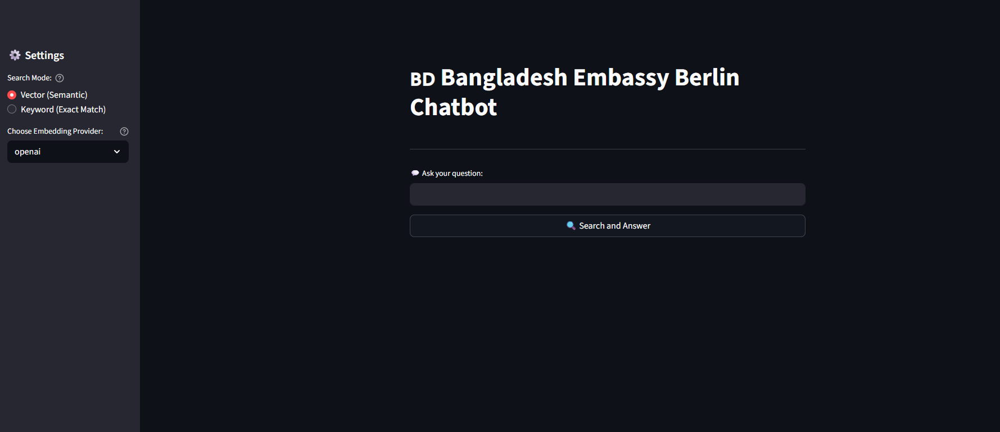

# Chatbot Embassy Berlin

<p align="center">
  <br>
</p>
#Bangladesh Embassy Berlin — Multilingual RAG Chatbot

An end-to-end **Retrieval-Augmented Generation (RAG)** chatbot designed to assist users with consular service inquiries (e.g., passports, visas, dual nationality certificates, attestation, and fees) for the Bangladesh Embassy in Berlin.

---

## 📌 Project Overview

Navigating consular instructions across multiple languages and complex web pages can be challenging. This project addresses that problem by:
- Scraping and cleaning data directly from the official embassy portal.
- Converting consular text into dense vector embeddings using multilingual models (OpenAI / Cohere).
- Leveraging **FAISS** for millisecond-latency vector similarity retrieval.
- Using an LLM through an interactive **Streamlit** user interface to provide grounded, hallucination-free answers in multiple languages.

---

## 🚀 Key Features

* **Multilingual Query Support**: Accepts and processes inquiries in English, Bengali, and German[cite: 2].
* **Automated Data Processing**: Scrapes, extracts, cleans, and standardizes web content into clean JSON documents[cite: 2].
* **Semantic Text Chunking**: Splits large documents into overlapping token chunks to preserve context boundaries[cite: 2].
* **Dual Embedding Backend**: Built-in support for both **OpenAI** and **Cohere** multilingual embeddings[cite: 2].
* **Fast Vector Indexing**: Serializes and queries dense vector representations using Facebook AI Similarity Search (**FAISS**)[cite: 2].
* **Interactive Streamlit UI**: User-friendly chat interface with streaming responses and contextual verification[cite: 2].

---

## 🏗️ System Architecture & Workflow

```text
[ Embassy Web Pages ]
          │
          ▼
   1. Ingestion & Cleaning (`parser/`)
          │  Extracts text & strips HTML boilerplate -> `output.cleaned.json`
          ▼
   2. Semantic Chunking (`retrieval/src/text_chunker.py`)
          │  Divides text into overlapping contextual blocks
          ▼
   3. Embedding & Indexing (`retrieval/src/build_multilingual_faiss.py`)
          │  Generates vector embeddings (Cohere / OpenAI) -> saves to FAISS
          ▼
   4. Query & RAG Generation (`streamlit/chatbot_mul.py`)
             Embeds user query -> searches FAISS -> injects context -> streams LLM answer
## How to run (parser)

### 1. Create & activate virtual environment

```bash
python3 -m venv .venv
source .venv/bin/activate    # macOS/Linux
.venv\Scripts\activate       # Windows
```
## 📁 Repository Structure

```text
Chatbot_BD_Embassy_Berlin/
├── parser/                                # Data Scraping & Preprocessing Pipeline
│   ├── src/
│   │   ├── crawler.py                     # Scrapes web pages from the official embassy portal
│   │   ├── cleaner.py                     # Strips HTML boilerplate and extracts clean text
│   │   └── utils.py                       # File I/O and JSON data utility functions
│   ├── scripts/
│   │   └── run.py                         # Automation script to trigger scraping and cleaning
│   └── data/
│       ├── clean/
│       │   └── output.cleaned.json        # Cleaned dataset structured with URLs, titles, and text
│       └── vector/                        # Stored vector files, embeddings, and FAISS indices
│           ├── cohere/                    # Cohere index files (.index, .npy, meta.json)
│           └── openai/                    # OpenAI index files (.index, .npy, meta.json)
├── retrieval/                             # Chunking, Embedding & Indexing Pipeline
│   └── src/
│       ├── text_chunker.py                # Splits cleaned documents into semantic chunks with overlap
│       ├── multilingual_embeddings.py     # Generates vector embeddings (OpenAI / Cohere)
│       ├── faiss_index.py                 # Wrapper for FAISS index creation and nearest-neighbor search
│       ├── build_multilingual_faiss.py    # Main builder script to index documents
│       └── search_multilingual_faiss.py   # CLI tool to test and verify similarity search
├── streamlit/                             # User Interface & RAG Query Pipeline
│   ├── chatbot_mul.py                     # Streamlit application entry point and chat handler
│   ├── embeddings_handler.py              # Loads and caches precomputed vector embeddings
│   ├── embeddings_cohere.pkl              # Pickled Cohere embeddings cache
│   ├── embeddings_openai.pkl              # Pickled OpenAI embeddings cache
│   ├── temp_context.txt                   # Buffer for holding retrieved context passages
│   └── .streamlit/
│       └── secrets.toml                   # API keys and secret configuration
├── requirements.txt                       # Python dependencies
└── README.md                              # Project documentation
### 2. Install dependencies

```bash
pip install -r requirements.txt
```
## 🛠️ Tech Stack & Dependencies

* **Language**: Python 3.10+[cite: 2]
* **Frontend / UI**: Streamlit[cite: 2]
* **Vector Search Engine**: FAISS (`faiss-cpu`)[cite: 2]
* **Embedding Providers**: OpenAI Embeddings (`text-embedding-3-small`) & Cohere Multilingual Embeddings (`embed-multilingual-v3.0`)[cite: 2]
* **Large Language Models (LLM)**: OpenAI API (`gpt-4o` / `gpt-3.5-turbo`)[cite: 2]
* **Web Scraping & HTML Cleaning**: BeautifulSoup4 (`bs4`), Requests[cite: 2]
* **Data Processing & Serialization**: NumPy, Pickle[cite: 2]

---

## ⚙️ Module Responsibilities

* **`parser/src/crawler.py`**: Discovers and downloads HTML content across consular service categories from the official Bangladesh Embassy Berlin website[cite: 2].
* **`parser/src/cleaner.py`**: Extracts text from raw HTML, removes headers, footers, scripts, and navigation menus, and standardizes data into structured JSON entries[cite: 2].
* **`parser/scripts/run.py`**: Orchestrates the automated scraping and cleaning workflow to produce `output.cleaned.json`[cite: 2].
* **`retrieval/src/text_chunker.py`**: Splits cleaned documents into fixed-size semantic chunks with overlap to maintain contextual integrity across document splits[cite: 2].
* **`retrieval/src/multilingual_embeddings.py`**: Connects to the OpenAI and Cohere APIs to generate high-dimensional vector representations for multilingual text[cite: 2].
* **`retrieval/src/faiss_index.py`**: Provides helper methods to initialize, populate, save, and query dense FAISS similarity indices[cite: 2].
* **`retrieval/src/build_multilingual_faiss.py`**: Main indexing pipeline script that processes `output.cleaned.json`, computes embeddings, and serializes the index and metadata to disk[cite: 2].
* **`retrieval/src/search_multilingual_faiss.py`**: Command-line verification tool to test top-$k$ nearest-neighbor retrieval quality[cite: 2].
* **`streamlit/chatbot_mul.py`**: Primary web application entry point managing chat history, query embedding, FAISS similarity search, prompt augmentation, and response streaming[cite: 2].
* **`streamlit/embeddings_handler.py`**: Loads and caches vector indices and metadata into Streamlit memory to ensure low-latency query handling[cite: 2].

### Run the parser

```bash
python -m parser.scripts.run \
  --start-url https://berlin.mofa.gov.bd/ \
  --max-pages 0 \
  --out parser/data/clean/output.cleaned.json
```

### For faiss

```bash
python -m retrieval.src.build_faiss \
  --in parser/data/clean/output.cleaned.json \
  --index-out parser/data/vector/faiss_l2.index \
  --meta-out  parser/data/vector/meta.json \
  --index-type flat_l2 \
  --max-chars 900 --overlap 150 \
  --model paraphrase-multilingual-MiniLM-L12-v2
```

### For query

```bash
python -m retrieval.src.search_faiss \
  --index parser/data/vector/faiss_l2.index \
  --meta  parser/data/vector/meta.json \
  --model paraphrase-multilingual-MiniLM-L12-v2 \
  --query "Address of Embassy" \
  --top-k 1 \
  --collapse url
```

- start-url → the seed URL (starting point for crawling).
- max-pages → 0 = crawl all pages in the domain (set a number to limit).
- out → file path where the cleaned JSON will be saved.
